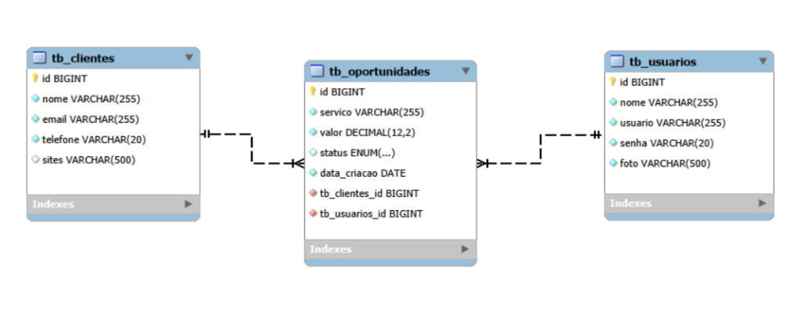

# Nome do Projeto - Conecta CRM

<br />

<div align="center">
    
</div>

<br />

## 1. Descrição
O **Conecta CRM** é uma solução de backend estruturada para centralizar o gerenciamento de clientes e o ciclo de vida de oportunidades comerciais. Esta API REST foi desenvolvida pela squad **BugSlayers** utilizando **NestJS** e **TypeScript**, focando na organização do funil de vendas e na rastreabilidade total das negociações de uma empresa.

---

## 2. Sobre esta API
A aplicação permite a gestão completa de clientes e oportunidades, garantindo que o time comercial tenha dados sólidos para a tomada de decisão.

### 2.1. Funcionalidades Principais (End-points)

* **Gestão de Clientes (`/clientes`)**
    * `POST /clientes`: Cadastrar novas empresas/contatos.
    * `GET /clientes`: Listar todos os clientes cadastrados.
    * `GET /clientes/:id`: Buscar detalhes de um cliente específico.
    * `PUT /clientes`: Atualizar dados cadastrais.
    * `DELETE /clientes/:id`: Remover registro de cliente.

* **Gestão de Oportunidades (`/oportunidades`)**
    * `POST /oportunidades`: Abrir nova negociação no funil.
    * `GET /oportunidades`: Monitorar o progresso de vendas (Status: Aberta, Ganha, Perdida).
    * `GET /oportunidades/valor/:valor`: Filtrar oportunidades por potencial financeiro.

* **Gestão de Usuários (`/usuarios`)**
    * `POST /usuarios`: Cadastrar novos colaboradores no CRM.
    * `GET /usuarios/all`: Listagem de usuários internos.

---

## 3. Modelagem do Projeto

### 3.1. Diagrama de Classes
<div align="center">
    
</div>

### 3.2. Diagrama Entidade-Relacionamento (DER)
<div align="center">
    
</div>

---

## 4. Tecnologias Utilizadas

| Item | Descrição |
| :--- | :--- |
| **Servidor** | Node.js |
| **Linguagem** | TypeScript |
| **Framework** | NestJS |
| **ORM** | TypeORM |
| **Banco de Dados** | MySQL |

---

## 5. Configuração e Execução

Para rodar o projeto localmente, siga os passos abaixo:

### 5.1. Pré-requisitos
* Node.js instalado (v20 ou superior recomendada)
* MySQL Server ativo e rodando
* Um gerenciador de pacotes (NPM ou Yarn)

### 5.2. Passo a Passo
1. **Clone o repositório:**
   ```bash
   git clone https://github.com/Grupo04-BugSlayers-TurmaJS13/crm-backend.git
   ```
2. **Acesse a pasta do projeto:**
   ```bash
   cd Docs
   ```
3. **Instale as dependências:**
   ```bash
   npm install
   ```
4. **Configure o Banco de Dados:**
   Crie um arquivo `.env` na raiz do projeto com as suas credenciais:
   ```env
   DB_HOST=localhost
   DB_PORT=3306
   DB_USER=seu_usuario
   DB_PASS=sua_senha
   DB_NAME=db_conecta_crm
   ```
5. **Execute a aplicação:**
   ```bash
   npm run start:dev
   ```
O servidor estará rodando em: `http://localhost:4000` (ou a porta configurada).

---

## Contribuição
Este é um projeto de código aberto e as contribuições são bem-vindas. Para saber como contribuir, por favor, consulte o nosso [Guia de Contribuição](CONTRIBUTING.md).
